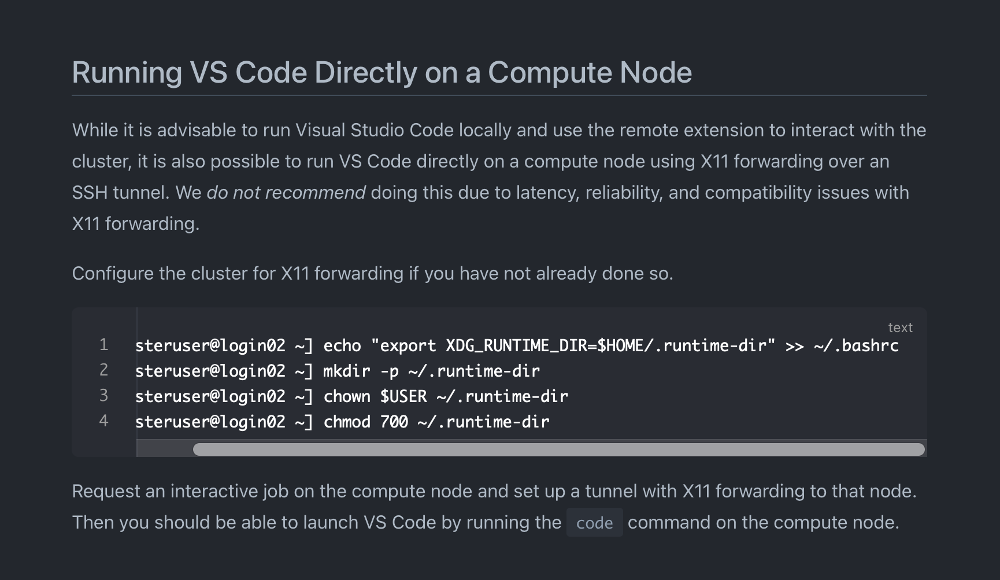

## A brief instruction on how to access compute node on slurm using VScode (to run apps, including jupyter notebook) at UIUC illnois campus cluster (ICC)

This repo is a note for how to setup compute node access on slurm and access with VSCode to run apps like jupyter notebook. Tested on UIUC Illnois Campus Cluster (ICC).

There are apparently many different way to access the jupyter notebook on slurm:

1. run jupyter notebook on login node
2. Run notebook on compute node (persistently), and access it each time.
3. Each time ssh to the compute node, and start a jupyter server.

We can't run jupyter on slurm login node, especially in systems like UIUC ICC where the job will be killed after 30 CPU-minutes. So we rule out the fist method.

The following method will be based on running notebook on compute node, and this is only the one best way I figured among the others. This method is only tested on MAC OS.

The most important reference is from: https://docs.chpc.wustl.edu/software/visual-studio-code.html.

## 1. Generate SSH key pairs on your local machine

- 1.1 Open the terminal of your local machine, run `ssh-keygen`. Press enter for all default setting. A pair of keys will be generated as ~/.ssh/id_rsa (private key) and ~/.ssh/id_rsa.pub (public key). If you already have a key pairs, just use it and no need to regenerate.

- 1.2 Copy the public key to the login node of the cluster server. 

```sh
ssh-copy-id yc85@cc-login.campuscluster.illinois.edu
```

where yc85 is your user name.

## 2. Setup VScode node:

- 2.1 VS Code has a little bit of trouble with Slurm's module system. Append the following to your ~/.bashrc on the cluster:

```sh
export MODULEPATH=$MODULEPATH:/opt/modulefiles
```

- 2.2 Modify ssh config file on your local machine:

Add these to your `~/.ssh/config` file on your local machine

```
Host ICC-compute
  Hostname 127.0.0.1 
  User yc85
  IdentityFile ~/.ssh/id_rsa
  Port 8781

```

Port `8781` is not special, so you can change it. Don't change the `127.0.0.1`. The `~/.ssh/id_rsa` corresponds to your private key.


- 2.3 Configure the cluster for X11 forwarding



So do these on your cluster login node:

```
[clusteruser@login02 ~] echo "export XDG_RUNTIME_DIR=$HOME/.runtime-dir" >> ~/.bashrc
[clusteruser@login02 ~] mkdir -p ~/.runtime-dir
[clusteruser@login02 ~] chown $USER ~/.runtime-dir
[clusteruser@login02 ~] chmod 700 ~/.runtime-dir
```


## 3. Login

- 3.1 The first step of the login is to make a tunnel from your local machine, though the cluster login node, to the compute node.

Open a terminal on your local machine, run:

```sh
ssh -L 8781:ccc0335:22 yc85@cc-login.campuscluster.illinois.edu
```
This setup forwards any connections made to localhost:8781 on your local machine to port 22 on the ccc0335 host (SSH port on the computation node).

This should login to your login node on the cluster.

- 3.2 Submit a srun job

To allocate resources, submit a srun job:

```sh
srun -w ccc0335 --partition=aces --nodes=1 --time=29-00:00:00 --mem=50GB --cpus-per-task=5 --pty bash
```

For convenience, I made an alias of this command and add it to my `~/.bashrc` file on the login node:

```sh
alias get_compute_resources_ccc0335='srun -w ccc0335 --partition=aces --nodes=1 --time=29-00:00:00 --mem=50GB --cpus-per-task=5 --pty bash'
```

So that each time I only need to call `get_compute_resources_ccc0335`.

Notice that 3.1 and 3.2 are consecutive, so you should be able to finish these two steps in the same terminal.

If you close this terminal, then everything, including the tunnel and the srun job will be terminated. So you will keep it open throughout the coding today, shut down when you finish today's work (then everything automatically stop), and redo this tomorrow.

- 3.3 Open your VScode, on the left lower corner you should have a link icon to click on, if you have the ssh extension installed. Click - connect to host - ICC-compute. This should open a new window of VScode for you. Open a vscode terminal inside this window. If it shows `(base) [yc85@ccc0335 ~]$ `, then you are on the compute node! Now you can do the things you want, like open a jupyter notebook.

## 4. It's a new day

It's a new day! To start working on vscode + slurm + jupyter, you:

1. Open your local terminal, run `ssh -L 8781:ccc0335:22 yc85@cc-login.campuscluster.illinois.edu`
2. You will login to the login node of cluster. Run `get_compute_resources_ccc0335`.
3. Open your VScode, connet to host `ICC-compute`.
4. Start working! 
